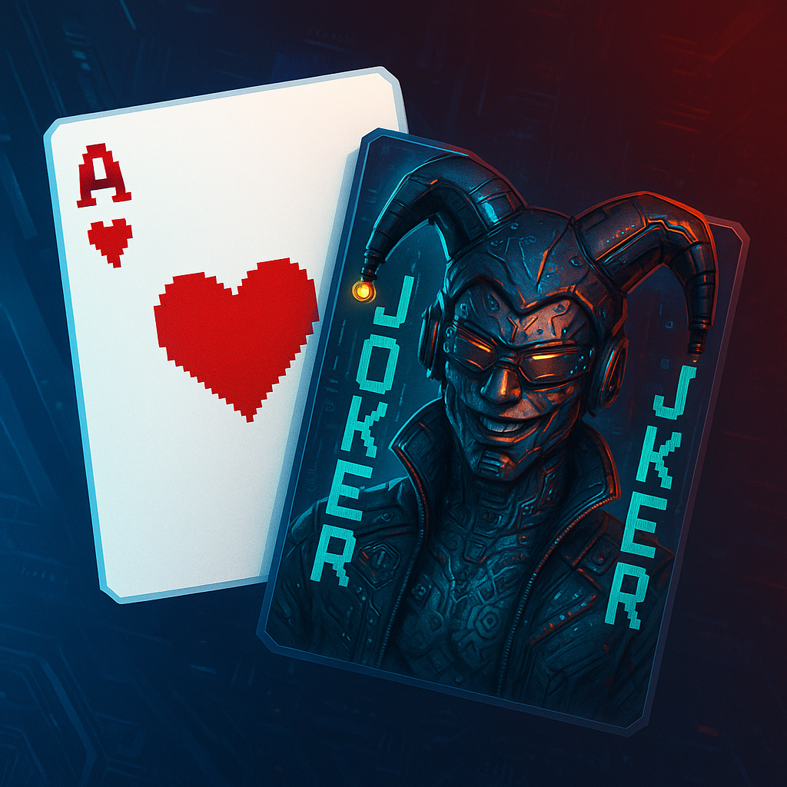

# Balatrools 🎴

A powerful collection of tools and resources for Balatro game file manipulation and exploration.

> **🤖 AI Development Notice**:  
> This project is developed with assistance from generative AI tools (GitHub Copilot, ChatGPT).  
> However, all code suggestions are:
>
> - Manually reviewed and validated
> - Only implemented after human verification
> - Properly documented and commented
> - Tested before integration

## Features ✨

### Advanced File Editing

- **Profile Editor**: Modify your game progress
- **Save File Editor**: Edit your current game saves
- **Settings Editor**: Customize game settings and configurations

### Card Discovery & Management 🃏

- Browse and explore all available joker cards
- View detailed card information and statistics
- View and Edit card data in JSON format in Browser

### Enhanced Data Visualization

- **JSON View**: Raw data inspection and editing capabilities
- **Interactive UI**: User-friendly interface for all editors
- **Card Preview**: Visual representation of game elements

### File Format Support

- `.save` files
- `.profile` files
- `.meta` files

## Installation & Setup Guide 🛠️

### Prerequisites

- Node.js (v18 or higher) 📦
- pnpm (v9 or lower) 🔧

### Quick Start ⚡

```bash
# Clone the repository
git clone https://github.com/yourusername/balatrools.git

# Navigate to project directory
cd balatrools

# Install dependencies
pnpm install

# Start development server
pnpm dev
```

Your development server will be running at http://localhost:3000 🚀

### Available Commands 💻

| Command      | Description                             |
| ------------ | --------------------------------------- |
| `pnpm dev`   | Start development server with Turbopack |
| `pnpm build` | Create production build                 |
| `pnpm start` | Run production server                   |
| `pnpm lint`  | Run ESLint code checks                  |

### Technical Details 🔍

- **Framework**: Next.js with React 19
- **Language**: TypeScript
- **Package Manager**: pnpm
- **Node Version**: ≥18.0.0

### Development Notes 📝

- The project uses Next.js with Turbopack for enhanced development experience
- All code is strictly typed with TypeScript
- Supports editing of `.save`, `.profile`, and `.settings` files
- Features JSON visualization and editing capabilities

## Getting Started 🚀

1. Select your file type in the editor
2. Upload or drag & drop your game file
3. Make your desired changes
4. Export the modified file

## Legal Notice

All rights reserved to Balatro and localthunk for sprites and other assets.


